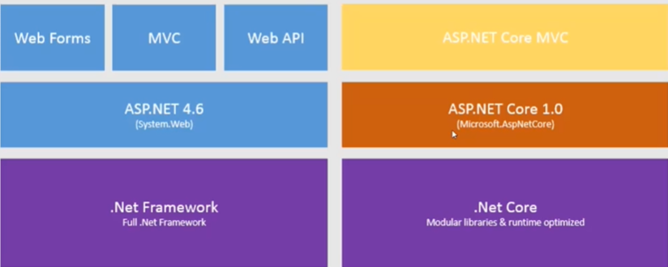
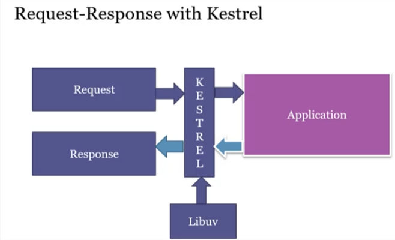
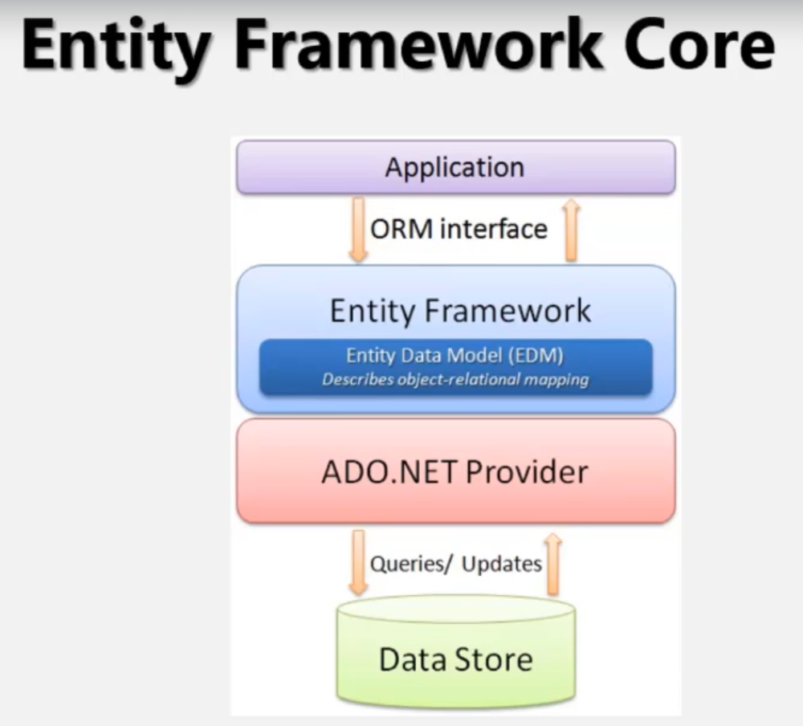
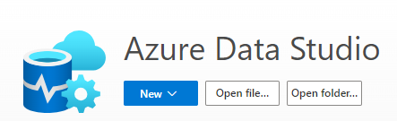

##  ASP.NET CORE: APRENDENDO DO ZERO

# O QUE APREENDI NO CURSO 
ASP.NET Core é o novo framework open-source e cross-platform para construir aplicações modernas. ASP.NET Core pode executar sobre .NET Core e .NET Framework. Tem uma melhor performance sobre a plataforma antiga e pode ser desenvolvida a partir de qualquer editor de código fonte e em qualquer sistema operacional.

HOST

ENTITY FRAMEWORK CORE

AZURE DATA STUDIO

**Fonte: Stephany Henrique de Almeida Batista / ASP.NET Core: Aprendendo do zero ao avançado*

 

##  TECNOLOGIAS UTILIZADAS NO DESENVOLVIMENTO DO PROJETO

 

 

 

